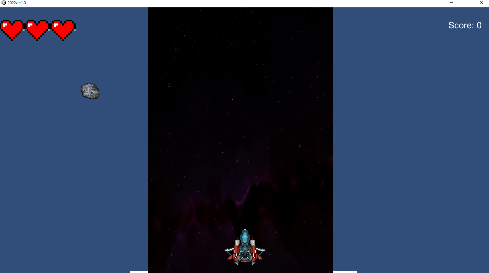
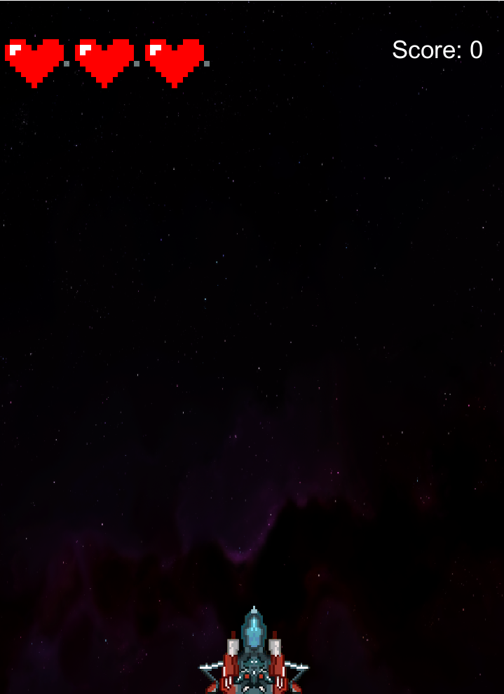

## 목표

- 게임 전체 화면 시 배경 화면과 바닥이 확장되지 않는 것을 해결

- 창모드와 전체 모드 시 해상도 고정


---

### 문제점 발생

<br>

- 지난 게시글 GameBuild에서 해상도를 설정하고 게임을 빌드했을 당시엔 문제가 없었다. 하지만 ALT + ENTER를 눌러 전체 화면으로 변경하자 문제가 발생했다.

  

문제 1. 배경과 바닥은 그대로인데, 다른 canvas 에 들어있는 요소들은 확장된 해상도에 맞게 바뀌었다.

문제 2. 앞선 문제로 인해 내가 설정한 난이도 (운석의 속도와 비행기의 속도)에 맞지 않게 되었다.


---

### SetResolution

<br>

- 이러한 문제점을 해결하는 함수가 Unity에 존재한다. 코드부터 살펴보자

```csharp
void Awake()
{
    ...
    SetResolution();
}

...
public void SetResolution()
{
    int setWidth = 720;
    int setHeight = 1280;

    Screen.SetResolution(setWidth, setHeight, false);
}
```

> <span style = "color:blue">**SetResolution(int width, int height, bool fullscreen, int Rate)**</span>: width * height at Rate hz

- SetResolution 함수는 주어진 width * height의 해상도로 전환하고, 주사율을 Rate로 설정한다. 이때 bool 값이 true면 전체 화면으로 시작하고, false면 창모드로 시작한다. 
- 2022 게임은 720 * 1280 환경에서 작업을 했으므로 setWidth 를 720, setHeight를 1080으로 설정하고, 시작 시 창모드가 되게 bool 값을 false로 주었다. 
- Rate는 지원되는 해상도를 지정하는 것인데 기본으로 0으로 설정되어 있다.

<br>


