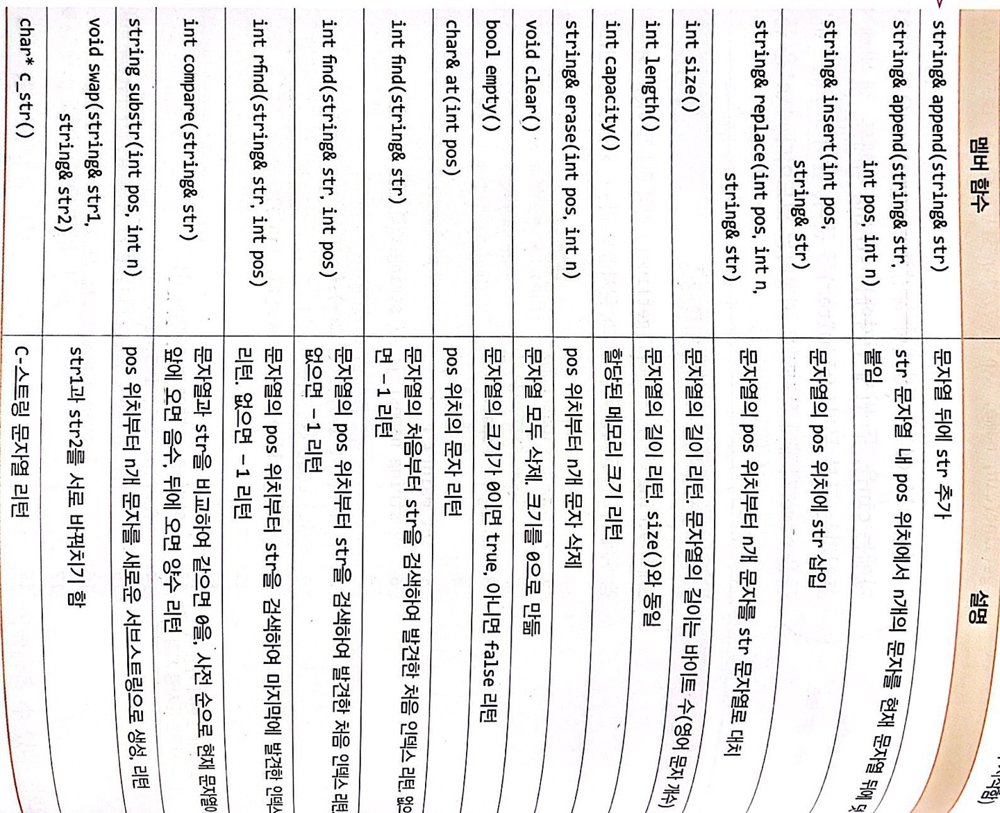

---

title: "Chapter 4 Object Pointer, Array, Dynamically Allocation(2)"
layout: single
categories:
  - Cpp

tags:
  - Cpp
  - Language
published: true

---

### 객체와 객체 배열의 동적 생성 및 반환

<br>

```cpp
// 예제 4-7
#include <iostream>
using namespace std;

class Circle
{
    int radius;

public:
    Circle(); // default constructor
    Circle(int r); // constructor
    ~Circle(); // destructor
    void setRadius(int r) { radius = r; } // Inline function
    double getArea() { return 3.14 * radius * radius; } // Inline function
};

Circle::Circle() : radius(1) {}
Circle::Circle(int r)
{
    radius = r;
    cout << "생성자 실행 radius = " << radius << endl;
}
Circle::~Circle() { cout << "소멸자 실행" << endl; }

int main()
{
    Circle* p, * q; // 포인터 객체 선언
    p = new Circle; q = new Circle(30); // 동적 할당

    cout << p->getArea() << endl << q->getArea() << endl;

    delete p; delete q; 
}
```

<br>

- 객체의 동적 생성 및 반환

  - 동적 생성: 클래스 크기의 메모리를 할당받아 객체를 생성

    ```cpp
    <클래스이름> *<포인터변수> = new <클래스이름>; // 기본 생성자 호출
    <클래스이름> *<포인터변수> = new <매개변수>; // 매개 변수 있는 생성자 호출
    ```

  - 객체 반환: 동적으로 할당받은 객체 반환.

    ```cpp
    delete <포인터변수>
    ```

    - 이때 <포인터변수>는 반드시 **new를 이용해 동적 할당받은 메모리의 주소**여야 한다.
    - **객체를 반환하기 전에 객체 소멸자가 먼저 실행**된다.

<br>

```cpp
// 예제 4-8
// 정수 값으로 반지름을 입력받고, Circle 객체를 동적 생성하여 면적을 출력하는 프로그램.
// 음수가 입력되면 프로그램은 종료한다.
#include <iostream>
using namespace std;

class Circle
{
    int radius;

public:
    Circle(); // default constructor
    Circle(int r); // constructor
    ~Circle(); // destructor
    void setRadius(int r) { radius = r; } // Inline function
    double getArea() { return 3.14 * radius * radius; } // Inline function
};

Circle::Circle() : radius(1) {}
Circle::Circle(int r)
{
    radius = r;
    cout << "생성자 실행 radius = " << radius << endl;
}
Circle::~Circle() { cout << "소멸자 실행" << endl; }

int main()
{
    int radius;

    while (true)
    {
        cout << "정수 반지름 입력(음수면 종료)>> ";
        cin >> radius;

        if (radius < 0)
            break;

        Circle* p = new Circle(radius);

        cout << "원의 면적은 " << p->getArea() << endl;
        
        delete p;
    }
}

```

<br>

```cpp
// 예제 4-9
#include <iostream>
using namespace std;

class Circle
{
    int radius;

public:
    Circle(); // default constructor
    Circle(int r); // constructor
    ~Circle(); // destructor
    void setRadius(int r) { radius = r; } // Inline function
    double getArea() { return 3.14 * radius * radius; } // Inline function
};

Circle::Circle() : radius(1) {}
Circle::Circle(int r)
{
    radius = r;
    cout << "생성자 실행 radius = " << radius << endl;
}
Circle::~Circle() { cout << "소멸자 실행 radius = " << radius << endl; }

int main()
{
    int arraySize = 3;
    Circle* pArray = new Circle[arraySize]; // 객체 배열의 동적 생성

    for (int i = 0; i < arraySize; i++)
    {
        pArray[i].setRadius(10 * (i+1));
        cout << pArray[i].getArea() << endl;
    }

    Circle* p = pArray; // 포인터 p에 배열의 주소값 저장

    for (int i = 0; i < arraySize; i++)
    {
        cout << p->getArea() << endl;
        p++; // 다음 주소
    }

    delete[] pArray; // 객체 배열 반환
}
```

<br>

- 객체 배열의 동적 생성 및 반환

  - 동적 생성: 각 **객체에 대해 기본 생성자를 호출**한다. 이**때 매개 변수 있는 생성자를 직접 호출할 수 없지만 배열을 각 원소 객체로 초기화**할 수 있다.

    ```cpp
    <클래스이름> *<포인터변수> = new <클래스이름> [배열 크기];
    <클래스이름> *<포인터변수> 
        = new <클래스이름> [배열 크기] { <클래스이름>(매개변수), <클래스이름>(매개변수)};
    // 매개변수 있는 생성자 호출 방법
    ```

  
  - 객체 배열 반환: 소멸자의 실행 순서는 생성의 역순.
  
    ```cpp
    delete [] <포인터변수>;
    ```
  
  - 객체 배열의 사용
  
    - 동적으로 생성된 객체 배열은 보통 객체 배열처럼 사용한다.

<br>

```cpp
// 예제 4-10
// 원의 개수를 입력받고 Circle 배열을 동적 생성하기.
// 반지름 값을 입력받아 Circle 배열에 저장하고, 면적이 100에서 200인 원의 개수를 출력하라.
#include <iostream>
using namespace std;

class Circle
{
    int radius;

public:
    Circle(); 
    Circle(int r); 
    void setRadius(int r) { radius = r; } 
    double getArea() { return 3.14 * radius * radius; } 
};

Circle::Circle() : radius(1) {}
Circle::Circle(int r)
{
    radius = r;
    cout << "생성자 실행 radius = " << radius << endl;
}

int main()
{
    cout << "원의 개수를 입력하세요>> ";
    int arraySize = 0;
    cin >> arraySize;

    Circle* pArray = new Circle[arraySize]; 

    int radius = 0;

    for (int i = 0; i < arraySize; i++)
    {
        cout << i + 1 << "번째 원의 반지름을 입력하세요 >> ";
        cin >> radius;
        pArray[i].setRadius(radius);
    }

    Circle* p = pArray; 

    int count = 0;

    for (int i = 0; i < arraySize; i++)
    {
        if (p->getArea() >= 100 && p->getArea() <= 200)
        {
            cout << p->getArea() << ", ";
            count++;
        }
        p++;
    }

    cout << endl << "100에서 200 사이의 면적을 가진 원의 개수는 " << count << "개입니다." << endl;

    delete[] pArray; // 
}
```

<br>

- <span style = "color:red">**힙(heap)**</span>: 응용프로그램들이 **실행 중에 할당받아 사용하는 시스템 메모리**
  - 동적으로 할당받은 메모리는 메모리 누수가 발생할 수 있으므로 **필요 없을 때 힙에 반환**하여 메모리 공간을 여유롭게 하는 것이 바람직하다. 
    - <span style = "color:red"> **메모리 누수(memory leak)**</span>: 동적으로 할당받은 메모리의 주소를 잃어버려 힙에 반환할 수 없을 때 발생하는 것.
  - **new**를 이용하여 할당받은 메모리는 **프로그램이 종료할 때 자동으로 힙에 반환**한다.

---

### this 포인터

<br>

- <span style = "color:blue">**this**</span>: 객체 자신에 대한 포인터 변수
  - 객체의 멤버 함수가 호출될 때, <span style = "color:green">컴파일러에 의해 묵시적으로 삽입되어 보이지 않게 전달</span>되는 객체에 대한 주소.
  - this가 필요한 경우
    1. 멤버 변수의 이름과 **동일한 이름으로 매개 변수 이름**을 지을 때
    2. 객체의 멤버 함수에서 **객체 자신의 주소를 반환**할 때 (후에 연산자 중복을 구현할 때 자주 사용)
  
  - 제약 사항
    1. **클래스의 멤버 함수에서만 사용** 가능
    2. **static 멤버 함수에서는 사용 불가능** (객체가 생성되기 전 호출될 수 있고, 실행되는 시점에서 현재 객체가 존재하지 아니할 수 있음)

---

### string 클래스를 이용한 문자열 사용

<br>

- string 클래스는 문자열의 크기에 맞추어 스스로 메모리를 조절함.

<br>

```cpp
// 예제 4-11
#include <iostream>
#include <string> // string 클래스 사용
using namespace std;

int main()
{
    string str; // 스트링 객체 생성
    string address("서울시 성북구 삼선동 389");
    string copyAddress(address); // address를 복사한 스트링 객체 생성

    char text[] = { 'L', 'O', 'V', 'E', '\0' }; // c string
    string title(text); // 문자 배열을 가진 스트링 객체 생성

    cout << str << endl;
    cout << address << endl;
    cout << copyAddress << endl;
    cout << title << endl;

}
```

<br>

- string 객체 생성 및 출력

  - 생성자를 이용해 다양한 문자열을 생성할 수 있다.

  - 이때 cout 등을 이용해 화면에 출력할 수 있다.

  - new / delete 연산자를 이용해 동적 생성 및 반환이 가능하다.

    | 생성자                 | 설명                                                 |
    | ---------------------- | ---------------------------------------------------- |
    | string()               | 빈 문자열을 가진 스트링 객체 생성                    |
    | string(string& str)    | str을 복사한 새로운 스트링 객체 생성                 |
    | string(char* s)        | c-string s의 문자열을 복사해 스트링 객체 생성        |
    | string(char* s, int n) | 문자 배열 s에서 n개의 문자를 복사해 스트링 객체 생성 |

<br>

```cpp
// 예제 4-12
// 크기가 5인 string 배열을 선언하고 getline() 전역 함수를 이용해
// 문자열을 입력받아 사전 순으로 가장 뒤에 나오는 문자열을 출력하라.
#include <iostream>
#include <string> // string 클래스 사용
using namespace std;

int main()
{
    const int size = 5;
    string name[size]; // string 배열 선언
    
    for (int i = 0; i < size; i++)
    {
        cout << "이름: ";
        getline(cin, name[i]); // 이름을 name[i]에 저장
    }

    string lastString = name[0];
    for (int i = 0; i < size; i++)
    {
        if (lastString < name[i]) // name[i]가 lastString보다 크다면
        {
            lastString = name[i]; // lastSTring = name[i]
        }
    }

    cout << "가장 마지막에 나오는 문자열은 " << lastString << "입니다." << endl;

}
```

<br>

- string 객체에 문자열 입력
  - getline() 전역 함수를 이용해 입력받으면 된다.

<br>

```cpp
// 예제 4-13
// 빈칸을 포함하는 문자열을 입력 받고,
// 한 문자씩 왼쪽으로 회전하도록 문자열을 변경하고 출력하라.
#include <iostream>
#include <string> // string 클래스 사용
using namespace std;

int main()
{
    string str;
    cout << "문자열 입력>> ";
    getline(cin, str);
    // 내 풀이
    int count = 0;

    for(int i = 0; i < str.size(); i++)
    {
        for (int j = 0; j < str.size() - 1; j++)
        {
            swap(str[j], str[j + 1]);
        }
        cout << str << endl;
    }
    /*답안
    int len = str.length(); // 문자열의 길이
    
    for (int i = 0; i < len; i++)
    {
    	string first = str.substr(0,1);
    	string sub = str.substr(1, len - 1);
    	str = sub + first;
    	cout << str << endl;
    }
    */
}
```

```cpp
// 예제 4-14
// 덧셈 식을 문자열로 입력받아 계산하는 프로그램을 작성하라.
#include <iostream>
#include <string> 
using namespace std;

int main()
{
	string str, sum, strNum; 
	cout << "식을 입력하세요>> "; 
	getline(cin, str); // 식을 담을 객체 문자열 str 
	// 내답
	int result = 0;

	for (int i = 0; i < str.size(); i++)
	{
		if (str[i] != '+' ) // str[i]의 문자가 +가 아니라면
		{
			cout << str[i]; // 출력하고
			strNum = str[i]; // 문자열을 자른다
			sum.append(strNum); // sum이라는 문자열에 숫자를 합친다.
		}

		else if (str[i] == '+') // str[i]의 문자가 +라면
		{
			result += stoi(sum); // 지금까지 합친 숫자 sum을 result에 합치고
			cout << endl; 
			sum.clear(); // sum을 비운다
		}
	}
	
	result += stoi(sum); // 마지막 숫자를 합쳐준다

	cout << endl << result << endl;
    
    /* 답안
    int sum = 0, startIndex = 0;
    
    while(true)
    {
    	it fIndex = s.find('+', startIndex);
    	if (fIndex == -1)
    	{
	    	string part = str.substr(startIndex);
	    	
	    	if (part == "")
	    		break;
	    	
	    	cout << part << endl;
	    	
	    	sum += stoi(part);
	    	break;
    	}
    	
    	int count = fIndex - stratIndex;
    	string part = str.substr(startIndex, count);
    	
    	cout << part << endl;
    	
    	sum += stoi(part);
    	startIndex = fIndex + 1;
    }
    
    cout << "합: " << sum << endl;
    */
}
```

```cpp
// 예제 4-15
// & 키가 입력될 때까지 여러 줄의 영문 문자열을 입력 받고
// 찾는 문자열과 대치할 문자열을 각각 입력받아 문자열을 변경하라.
#include <iostream>
#include <string>
using namespace std;

int main()
{
    cout << "여러 줄의 문자열을 입력하세요. 입력의 끝은 &문자입니다." << endl;
    string str;
    getline(cin, str, '&');
    cin.ignore(); // enter 키 제거

    cout << "find: ";
    string findstr;
    getline(cin, findstr);

    cout << "replace: ";
    string replacestr;
    getline(cin, replacestr);

    int startIndex = 0;

    while (true)
    {
        int index = str.find(findstr, startIndex);

        if (index == -1)
        {
            cout << "문자열이 없거나 변경이 완료되었습니다." << endl;
            break;
        }

        str.replace(index, findstr.length(), replacestr);

        startIndex = index + findstr.length();
    }

    cout << str << endl;
}
```

<br>

- string 클래스의 주요 멤버 함수
  - append, insert, size, length, capacity, erase, clear, empty, at, find, rfind, compare, substr, swap ...

---

- 문제풀이: [GitHub - maloveforme/Cpp](https://github.com/maloveforme/Cpp)
