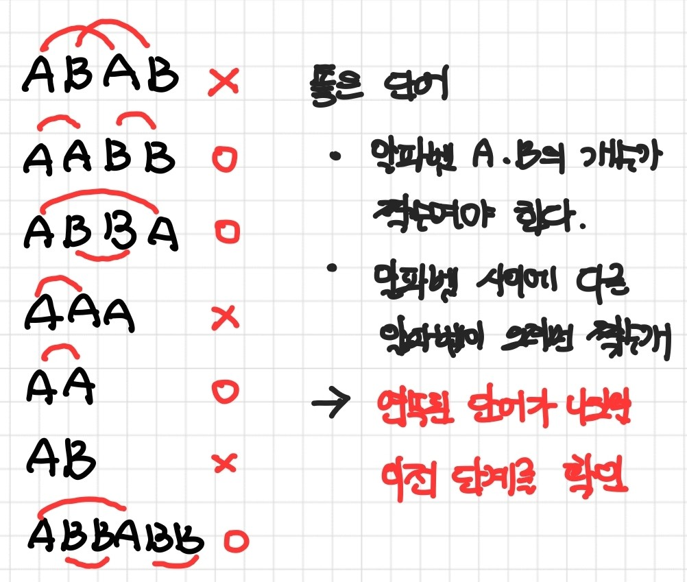
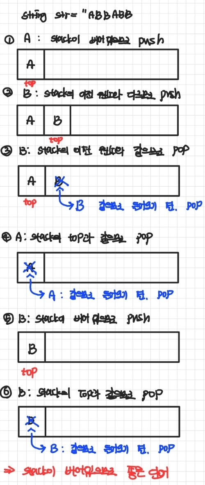
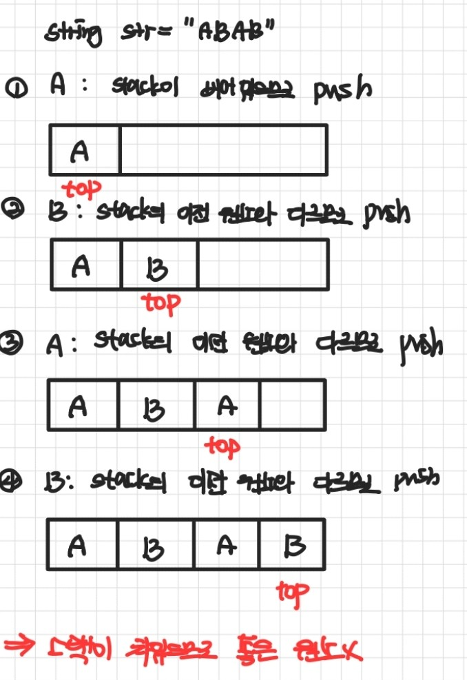

---

title: "백준(BOJ) 3986 C++"
layout: single
categories:
  - BOJ

tags:
  - Algorithm
  - BOJ

published: true

---

## 백준 3986 C++

<br>

### 문제 설명


<br>

### 입출력 예제


<br>

### 풀이

```cpp
#include <iostream>
#include <stack>
using namespace std;

int main()
{
	int num;
	cin >> num;
	int cnt = 0;

	for (int i = 0; i < num; i++)
	{
		string str;
		cin >> str;
		
		stack<char> input;
		for (int j = 0; j < str.size(); j++)
		{
			if (!input.empty() && input.top() == str[j])
				input.pop();

			else
				input.push(str[j]);
		}

		if (input.empty())
			cnt++;
	}

	cout << cnt;
}

```

- 개념

  

  - 문자를 하나씩 확인하며, 이전 문자와 비교하면 좋은 단어를 구분할 수 있다.

- 알고리즘

  ```cpp
  int num;
  cin >> num;
  int cnt = 0;
  ```

  - 입력 받을 단어의 개수를 num에 저장하고, 좋은 단어의 개수를 카운트할 변수 cnt를 선언한다.

  ```cpp
  string str;
  cin >> str;
  
  stack<char> input;
  ```

  - 좋은 단어인지 확인할 문자열을 str로 초기화하고, 하나씩 확인할 때 유용한 자료구조 stack을 선언한다.
    - 앞서 언급한 개념에서, **문자를 하나씩 확인하며 이전 문자와 비교하므로, LIFO 구조를 가진 stack을 활용**하면 유용

  ```cpp
  if (!input.empty() && input.top() == str[j])
      input.pop();
  
  else
      input.push(str[j]);
  ```

  - 문자를 하나씩 비교하는데, 이때 앞의 문자가 이전 문자와 다르면 문자를 pop하고, 그렇지 않다면 문자를 push해준다.

  ```cpp
  if (input.empty())
      cnt++;
  ```

  - 모든 반복이 끝났을 때, 스택이 비어있으면 좋은 단어이므로 갯수를 늘려준다.

---

- 보다 이해가 쉽게 되기 위해, 그림으로 과정을 표현하면 다음과 같다.

  

  


---

- [문제풀이](https://www.acmicpc.net/user/malove8466)

