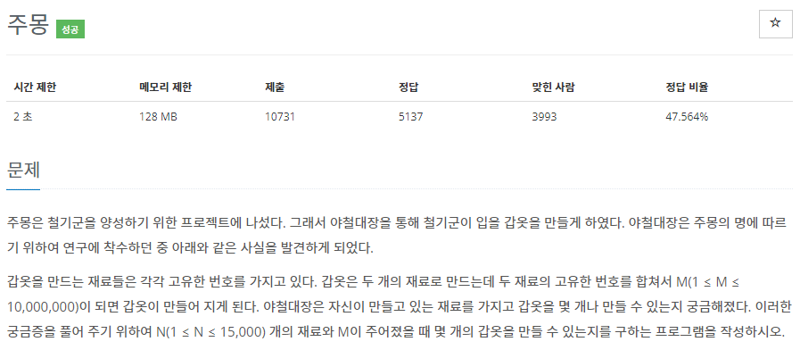
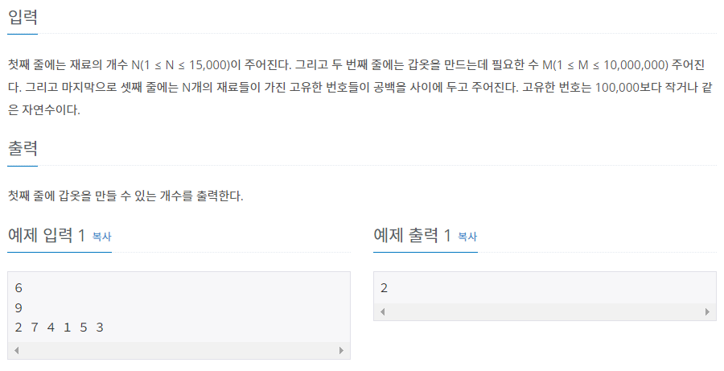
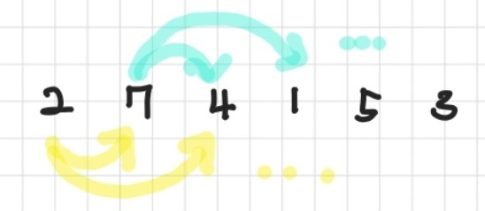

---

title: "백준(BOJ) 1940 C++"
layout: single
categories:
  - BOJ

tags:
  - Algorithm
  - BOJ

published: true

---

## 백준 1940 C++

<br>

### 문제 설명



<br>

### 입출력 예제



<br>

### 풀이

```cpp
#include <iostream>
using namespace std;

int main()
{
	int N, M, cnt = 0;
	int ary[150001] = {0};
	cin >> N >> M;

	for (int i = 0; i < N; i++)
		cin >> ary[i];

	for (int i = 0; i < N; i++)
	{
		for (int j = i + 1; j < N; j++)
		{
			if (ary[i] + ary[j] == M)
				cnt++;
		}
	}

	cout << cnt;
}
```

- 개념
  - 문제를 이해하기 어려워 보이지만, 이해하고 나면 쉬운 문제다. **고유 번호를 합쳤을 때 갑옷을 만드는 데 필요한 수를 확인**하면 된다.

- 알고리즘

  ```cpp
  int N, M, cnt = 0;
  int ary[150001] = {0};
  cin >> N >> M;
  
  for (int i = 0; i < N; i++)
      cin >> ary[i];
  ```
  
  - 재료의 개수 N, 갑옷을 만드는 데 필요한 수 M, 재료의 고유 번호 ary를 초기화해준다.
    - 여기서 visual studio 2022 기준으로 C6262 경고가 뜨는데, 이를 해결하고 싶으면 배열을 동적 할당으로 초기화하면 된다.
  
  
  ```cpp
  for (int i = 0; i < N; i++)
  {
      for (int j = i + 1; j < N; j++)
      {
          if (ary[i] + ary[j] == M)
              cnt++;
      }
  }
  ```
  
  
  
  - 다음과 같이 배열의 원소를 하나씩 검사하며 둘을 더했을 때 M이 되는지 확인한 후 개수를 증가시킨다.

---

- [문제풀이](https://www.acmicpc.net/user/malove8466)

