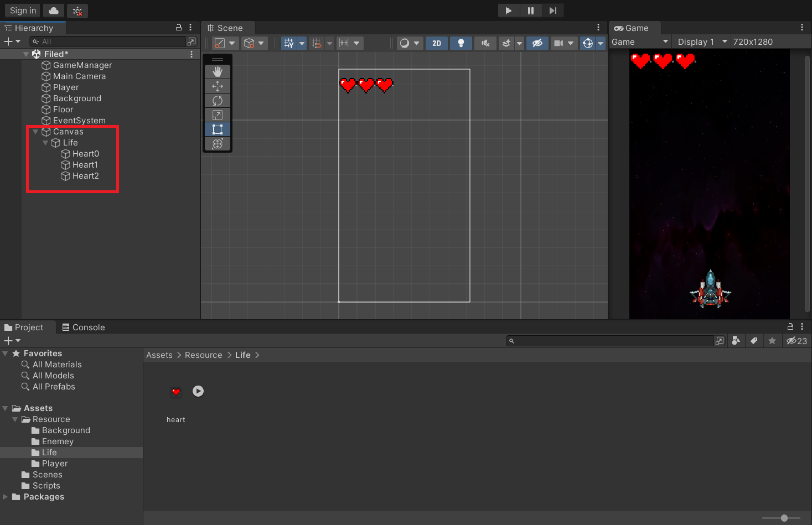
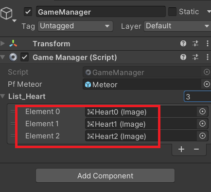

---

title: "GameManager Settings(2)"
layout: single
categories:

  - Unity
tags:
  - Unity
  - Unity2DGame

---

### 생명 구현하기

1. 생명을 구현하기 위해 Canvas를 추가한다.
2. Canvas에 생명을 가시적으로 표시할 이미지를 추가한다.




3. GM 스크립트에 생명을 List로 받아서 등록한다. 이때 Image를 다루기 위해 UI를 임포트해준다.

```C#

using UnityEngine.UI;
...
int PlayerLife = 3;
[SerializeField] List<Image> List_Heart;
...
    

```

- 여기서 리스트에 아까 캔버스에서 저장한 하트 이미지를 넣는다.




4. 이제 생명이 줄어들 때마다 하트 이미지를 안 보이게 하는 방식으로 생명을 구현하자. 다음과 같은 상황에서 하트가 사라진다.

   - 운석이 바닿에 닿았을 때

   - 플레이어가 운석과 닿았을 때

   ```C#
   void ShowHeart()
   {
       if(PlayerLife == 2)
       {
           List_Heart[2].gameObject.SetActive(false);
       }
       else if(PlayerLife == 1)
       {
           List_Heart[1].gameObject.SetActive(false);
       }
       else if(PlayerLife == 0)
       {
           List_Heart[0].gameObject.SetActive(false);
       }
   }
   ```

   - 이 함수를 앞서 언급한 상황에서 호출해주자.
   
     
   
   

​	