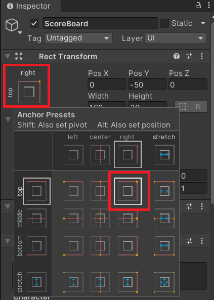
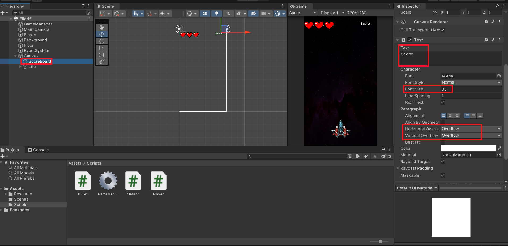

---

title: "GameManager Settings(3)"
layout: single
categories:
  - Unity
tags:
  - Unity
  - Unity2DGame
published: false
---

# 목표

- 운석을 파괴했을 때 점수를 얻는 것을 구현해보자
- 점수를 저장하는 기능을 구현해보자.

---


### 스코어 구현하기

1. Life를 구현했던 Canvas에서 Text를 추가해 ScoreBoard로 만들자.

   - 이때 아직 Mesh Pro는 다룰 단계가 아니기 때문에 Legacy에 있는 Text를 사용했다.

     

2. Text를 Score: 로 표시하고 위치를 화면의 우측 상단에 위치시키기 위해 Rect Transform에서 alt + shift 를 누르고 위치를 지정한다.




3. 이후 텍스트와 폰트 사이즈를 조절해준다.



> **Horizontal Overflow**: 글자가 만약 상자의 수평(좌우)의 크기를 넘었을 때 어떻게 처리할 것인지 처리 
>
> **Vertical OverFlow**: 글자가 만약 상자의 수직(상하)의 크기를 넘었을 때 어떻게 처리할 것인지 처리


4. 이제 스크립트를 작성해보자.

   - GameManager Script

     ```C#
     ...
     public Text Scoreboard;
     public int Score = 0;
     
     ...
     public void ShowScore()
     {
         Scoreboard.text = "Score: " + Score.ToString();
     }
     ```

   - Bullet Script

     ```C#
     ...
     
         private void OnTriggerEnter2D(Collider2D collision)
     {
         if (collision.CompareTag("Enemy"))
         {
             Destroy(collision.gameObject);
             Destroy(this.gameObject);
             GameManager.instance.Score++;
             GameManager.instance.ShowScore();
         }
     }
     ```


---


