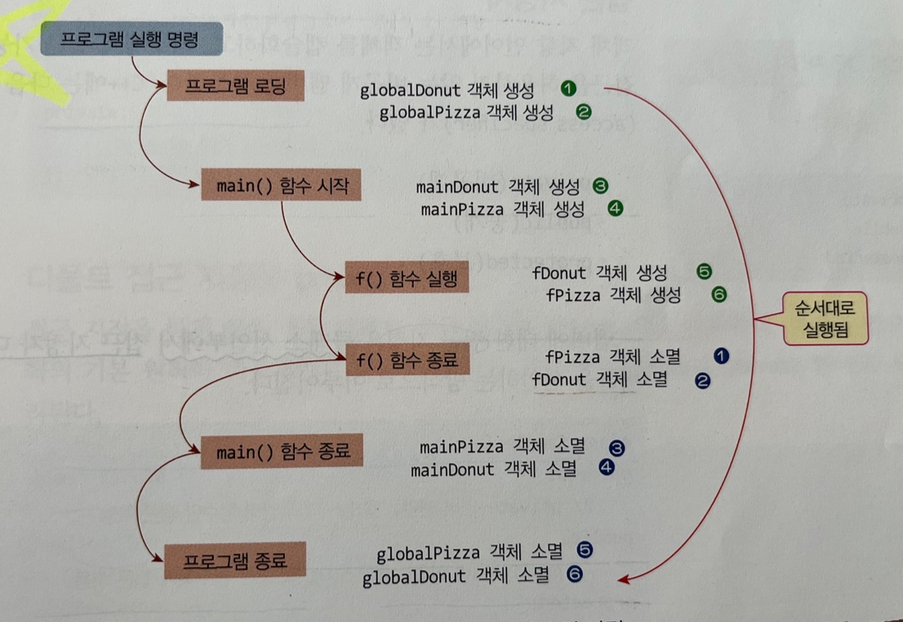
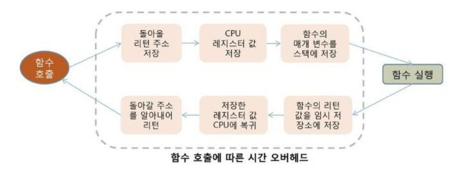
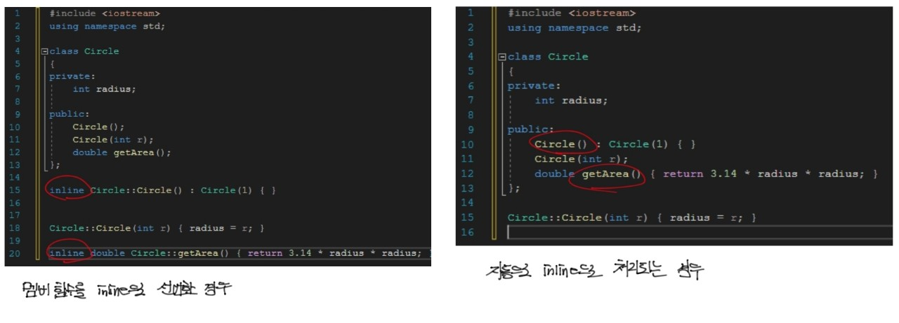
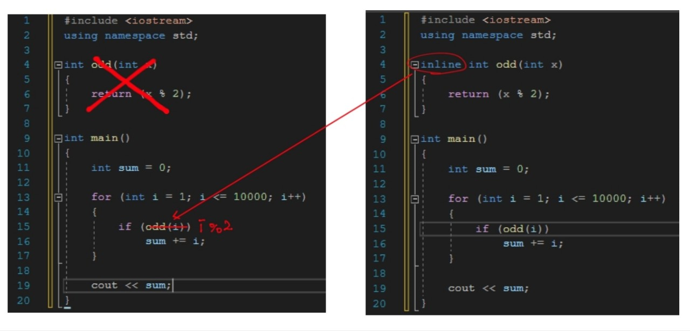

---

title: "Chapter 3 Class and Object(2)"
layout: single
categories:
  - Cpp

tags:
  - Cpp
  - Language
published: false
---


### 소멸자

<br>

- <span style = "color : red"> **소멸자**</span> : 객체가 소멸되는 시점에서 자동으로 호출되는 클래스의 멤버 함수.
  
  - 특징
    1. 소멸자(destructor)의 목적은 **객체가 사라질 때 필요한 마무리 작업**을 하기 위함이다.
    2. 소멸자의 이름은 **클래스 이름 앞에 ~**를 붙인다.
    3. 생성자와 같이 **리턴 타입이 없고, 어떤 값도 리턴해서도 안 된다**.
    4. 생성자와 같이 오직 **한 개만 존재**하며, **매개 변수를 가지지 않는다**.
    5. 소멸자가 선언되어 있지 않으면 기본 소멸자가 자동으로 생성된다.
    
  - **생성된 반대 순으로 객체가 소멸**됨.
  
    ```cpp
    // 예제 3-7
    #include <iostream>
    using namespace std;
    
    class Circle
    {
    public:
    	int radius;
    	Circle(); // 생성자
    	Circle(int r);
    	~Circle(); // 소멸자
    	double getArea();
    };
    
    Circle::Circle() : Circle(1) { }
    
    Circle::Circle(int r)
    {
    	radius = r;
    	cout << "반지름 " << radius << "인 원 생성\n";
    }
    
    Circle::~Circle()
    {
    	cout << "반지름 " << radius << "인 원 소멸\n";
    }
    
    double Circle::getArea()
    {
    	return 3.14 * radius * radius;
    }
    
    int main()
    {
    	Circle circle;
    	Circle donut(30);
    
    	return 0;
    }
    ```
  
    - 반지름 1인 원 생성 -> 반지름 30인 원 생성 -> 반지름 30인 원 소멸 -> 반지름 1인 원 소멸
  
  <br>
  
  - 지역 객체와 전역 객체
  
    - <span style = "color : red"> **지역 객체**</span>: 함수 내에서 선언된 객체로서, **함수가 실행될 때 생성**되고 **함수가 종료할 때 소멸**된다.
    - <span style = "color:red"> **전역 객체** </span>: 함수 바깥에 선언된 객체로서, **프로그램이 로딩될 때 생성**되고 main이 종료한 뒤 **프로그램 메모리가 사라질 때 소멸**된다.
  
    ```cpp
    // 예제 3-8
    #include <iostream>
    using namespace std;
    
    class Circle
    {
    public:
    	int radius;
    	Circle();
    	Circle(int r);
    	~Circle();
    	double getArea();
    };
    
    Circle::Circle() : Circle(1) {}
    
    Circle::Circle(int r)
    {
    	radius = r;
    	cout << "반지름 " << radius << "인 원 생성\n";
    }
    
    Circle::~Circle()
    {
    	cout << "반지름 " << radius << "인 원 소멸\n";
    }
    
    Circle globalDonut(1000); // 전역 객체1
    Circle globalPizza(2000); // 전역 객체2
    
    void f()
    {
    	Circle localDonut(100); // 지역 객체1
    	Circle localPizza(200); // 지역 객체2
    }
    
    int main()
    {
    	Circle donut; // 지역 객체3
    	Circle pizza(30); // 지역 객체4
    	f();
    }
    ```
  
    

---

### 접근 지정

<br>

- <span style = "color:red"> **접근 지정자**</span>: 객체 지향 언어에서 객체를 캡슐화하고, 외부에서 접근 가능한 **공개 멤버와** 접근을 막는 **비공개 멤버를 구분할 때 사용하는 지정자**.

  - 종류: <span style = "color:blue"> **private**</span>(비공개), <span style = "color:blue">**public**</span>(공개), <span style = "color:blue">**protected**</span>(보호)
  - 접근 지정은 여러 번 사용될 수 있고, 접근 지정자가 선언되면 다른 접근 지정자가 선언될 때까지 모든 멤버에 대해 적용된다.
  - **기본 접근 지정은 private**이다.
    - 클래스의 멤버들은 외부에서 마음대로 접근할 수 있도록 허용해서는 안 되므로, 변수 멤버는 private으로 지정하는 것이 바람직하다.
  - **생성자는 public**으로 지정하는 것이 바람직하다.
    - <span style = "color:green"> 하지만 의도적으로 외부에서 객체를 생성할 수 없도록 생성자를 private으로 선언하기도 하고, 상속된 클래스에서만 호출하도록 protected로 선언하기도 한다. </span>

  ```cpp
  // 예제 3-9
  #include <iostream>
  using namespace std;
  
  class PrivateAccessError
  {
  private:
  	int a;
  	void f();
  	PrivateAccessError();
  public:
  	int b;
  	PrivateAccessError(int x);
  	void g();
  };
  
  PrivateAccessError::PrivateAccessError() : a(1), b(1) { }
  
  PrivateAccessError::PrivateAccessError(int x)
  {
  	a = x; b = x;
  }
  
  void PrivateAccessError::f()
  {
  	a = 5; b = 5;
  }
  
  void PrivateAccessError::g()
  {
  	a = 6; b = 7;
  }
  
  int main()
  {
  	PrivateAccessError objA; 
  	// error : 매개 변수 없는 생성자는 private
  	PrivateAccessError objB(100);
  
  	objB.a = 10;
  	// error : a는 private으로 선언됨
  	objB.b = 20;
  
  	objB.f();
  	// error: vod f는 private으로 선언됨
  	objB.g();
  	
  	return 0;
  }
  ```

  ---

  ### 인라인 함수

  <br>

  

- <span style = "color:red"> **오버헤드(overhead)**</span>: 프로그램의 실행 흐름 중, 추가적으로 **자원이 소모되는 현상**

- <span style = "color:red">**인라인 함수(inline function)**</span>: 짧은 코드로 구성된 함수에 대해, 함수 호출 오버헤드로 인한 **프로그램의 실행 속도 저하를 막기 위해 도입된 기능**.

  - 함수 앞에 <span style = "color:blue"> **inline**</span> 키워드를 이용해 선언한다

  ```cpp
  inline <자료형> <함수이름>(매개변수)
  {
      statement(s);
  }
  ```

  - 장점: 함수 호출 오버헤드가 없어져 **실행 속도가 빨라진다**.

  - 단점: 호출하는 곳이 여러 곳 있으면, **전체 크기가 늘어난다** (따라서 **작은 함수를 인라인으로 선언**해야 좋음)

  - 특징

    - inline 선언은 컴파일러에게 요청하는 것이기 때문에 **불필요한 경우 무시**될 수 있다.

    - C++에서 멤버 함수의 크기가 작은 경우, 클래스의 선언부에 직접 구현해도 무방하다. (컴파일러가 인라인 함수로 자동 처리함)

      

  

  - 다음과 같은 함수가 inline 키워드를 붙이기 전에는 for문에 의해 odd(i)함수가 10000번 호출돼서 실행 시간이 길었지만, inline을 이용한 후에는 odd(i) 자리에  i % 2만 존재하게 하므로 속도가 향상됨.

---

### C++ 구조체

<br>

- 구조체: 표준 C 구조체에 기능을 확장하여 클래스와 동일한 구조와 기능을 가짐.

  - <span style = "color:blue">**struct**</span> 키워드를 이용해 선언한다.

  - 멤버 변수와 멤버 함수를 가지고, 접근 지정도 해야한다

    ```cpp
    struct <구조체이름>
    {
        statement(s);
    }
    ...
        
    <구조체이름> <구조체객체> // strcut 키워드를 사용해 객체를 생성하지 않음
    ```

  - 클래스와 구조체의 차이점은 **기본 접근 지정자 차이**다. **구조체는 public**인 반면, 클래스는 private이다.

    - 구조체와 클래스 중 어떤 것을 사용해도 상관없다.

  ```cpp
  // 예제 3-10
  #include <iostream>
  using namespace std;
  
  struct StructCircle
  {
  private:
  	int radius;
  
  public:
  	StructCircle(int r) { radius = r; }
  	double getArea();
  };
  
  double StructCircle::getArea()
  {
  	return 3.14 * radius * radius;
  }
  
  int main()
  {
  	StructCircle waffle(3);
  	cout << "면적은 " << waffle.getArea() << "입니다.\n";
  }
  ```

---

### 바람직한 C++ 프로그램 작성법

<br>

- 클래스마다 **선언부는 헤더 파일**에, **구현부는 cpp 파일에** 분리하여 작성한다.

- main() 등 **함수나 전역 변수는 한 개 이상의 cpp 파일**에 나누어 작성한다.

- 이때 분리한 헤더 파일은 전처리문으로 include 해야 한다.

- 헤더 파일의 중복이 발생할 수 있는데, 이를 방지하기 위해 <span style = "color:red">**조건 컴파일 문**</span>을 삽입하면 된다.

  ```cpp
  #ifndef <헤더파일 이름>
  #define <헤더파일 이름>
  ...
      
  #endif
  ```

---

- 문제풀이: [GitHub - maloveforme/Cpp](https://github.com/maloveforme/Cpp)
