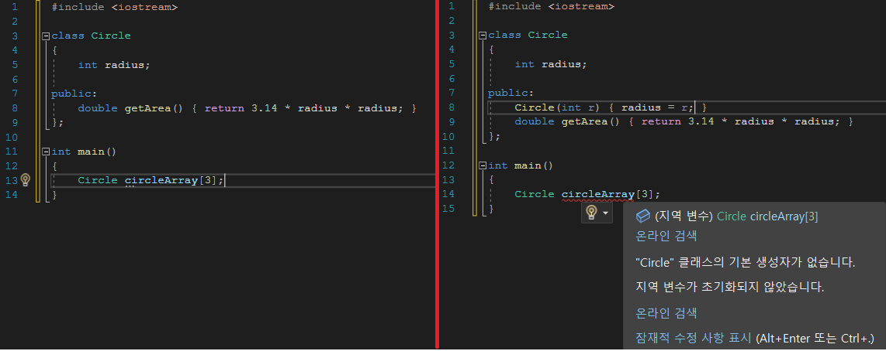

---

title: "Chapter 4 Object Pointer, Array, Dynamically Allocati(1)"
layout: single
categories:
  - language

tags:
  - Cpp
published: true
---


### 객체 포인터(Object Pointer)

<br>

- C++에서 객체를 다루기 위해 **객체에 대한 포인터 변수를 선언**하고, 이 포인터 변수로 **객체의 멤버 변수를 읽고 값을 쓰거나, 멤버 함수를 호출**할 수 있다.

<br>

```cpp
Circle donut;
double d = donut.getArea();

Circle *p; // 객체에 대한 포인터 선언
p = &donut; // 포인터 변수 p에 객체 donut의 주소 저장
// Circle *p = &donut으로 초기화 가능
d = p -> getArea(); // 멤버 함수 호출
// d = (*p).getArea(); 로 초기화 가능
```

- 해당 코드는 Circle 객체에 대한 포인터 변수 p를 선언하고 활용하는 사례다.
- <span style = "color:red">객체의 주소는 객체 이름 앞에</span> <span style = "color:blue">**& 연산자**</span>를 사용하여 표현한다.

- 객체 포인터로 멤버를 접근할 때 <span style ="color:blue"> **->** </span>**연산자**를 이용한다.

<br>

```cpp
// 예제 4-1
#include <iostream>
using namespace std;

class Circle
{
    int radius;

public:
    Circle();
    Circle(int r);
    double getArea();
};

Circle::Circle() { radius = 1; }
Circle::Circle(int r) { radius = r; }
double Circle::getArea() { return 3.14 * radius * radius; }


int main()
{
    Circle donut;
    Circle pizza(30);

    cout << donut.getArea() << endl;

    Circle* p1 = &donut;
    cout << p1->getArea() << endl;
    cout << (*p1).getArea() << endl;
   
    Circle* p2 = &pizza;
    cout << p2->getArea() << endl;
    cout << (*p2).getArea() << endl;
}
```

---

### 객체 배열(Object Array)

<br>

- 객체 배열은 원소가 객체라는 점을 제외하곤 기본 타입의 배열을 선언하고 활용하는 방법과 동일하다.

<br>

```cpp
// 예제 4-2
#include <iostream>
using namespace std;

class Circle
{
    int radius;

public:
    Circle();
    Circle(int r);
    void setRadius(int r);
    double getArea();
};

Circle::Circle() { radius = 1; }
Circle::Circle(int r) { radius = r; }
void Circle::setRadius(int r) { radius = r; }
double Circle::getArea() { return 3.14 * radius * radius; }

int main()
{
    Circle circleArray[3];

    for (int i = 0; i < 3; i++)
    {
        circleArray[i].setRadius(10 * (i + 1));
        cout << "Circle " << i << "의 면적은 " << circleArray[i].getArea() << endl;
    }

    Circle* p = circleArray;

    for (int i = 0; i < 3; i++)
    {
        cout << "Circle " << i << "의 면적은 " << p->getArea() << endl;
        p++;
    }
}
```

- 객체 배열 선언문은 오직 <span style = "color:red">**매개 변수 없는 기본 생성자**</span>을 호출한다.

  - 따라서 Circle circleArray[3]가 실행되면 3개의 Circle 객체가 생성되고, 각 객체마다 기본 생성자가 호출되는 것이다.

  - 만약 매**개 변수를 갖는 생성자가 선언되어 있으면, 기본 생성자가 선언되지 않기 때문에 오류**가 발생한다.

    

    - 따라서 객체 배열을 선언할 때 <span style = "color:red">**기본 생성자가 있는지 확인.**</span>

- **함수가 종료하면 함수 내에 선언된 배열도 소멸**된다. 이때 배열이 소멸되면, <span style = "color:red">**모든 객체가 소멸되어 높은 인덱스부터 낮은 인덱스까지의 원소 객체마다 소멸자가 호출된다**</span>.  
- 객체 포인터를 사용해 객체 배열을 다루는 방법은 여러가지다.
  1. 포인터를 이용
  2. 배열의 이름을 포인터로 사용
  3. 포인터의 정수 연산 이용

<br>

```cpp
// 예제 4-3
#include <iostream>
using namespace std;

class Circle
{
    int radius;

public:
    Circle();
    Circle(int r);
    void setRadius(int r);
    double getArea();
};

Circle::Circle() { radius = 1; }
Circle::Circle(int r) { radius = r; }
void Circle::setRadius(int r) { radius = r; }
double Circle::getArea() { return 3.14 * radius * radius; }

int main()
{
    Circle circleArray[3] = { Circle(10), Circle(20), Circle() };

    for (int i = 0; i < 3; i++)
    {
        cout << "Circle " << i << "의 면적은 " << circleArray[i].getArea() << endl;
    }
}
```

- 객체 배열을 초기화할 때 **생성자를 사용해 원소 객체를 초기화**할 수 있다.

<br>

```cpp
// 예제 4-4
#include <iostream>
using namespace std;

class Circle
{
    int radius;

public:
    Circle();
    Circle(int r);
    void setRadius(int r);
    double getArea();
};

Circle::Circle() { radius = 1; }
Circle::Circle(int r) { radius = r; }
void Circle::setRadius(int r) { radius = r; }
double Circle::getArea() { return 3.14 * radius * radius; }

int main()
{
    Circle circles[2][3];
    int p = 1;

    for (int i = 0; i < 2; i++)
    {
        for (int j = 0; j < 3; j++)
        {
            circles[i][j].setRadius(p);
            cout << "Circle [" << i << "," << j << "]의 면적은 " << circles[i][j].getArea() << endl;
            p++;
        }
    }
}
```

- C++에서는 해당 예제처럼 다차원 객체 배열을 만들 수 있다.
- 2차원 배열 역시 생성자를 지정해 배열을 초기화할 수 있다.

---

### 동적 메모리 할당 및 반환

<br>

```cpp
// 예제 4-5
#include <iostream>
using namespace std;

int main()
{
    int* p = new int;

    if (!p) // !p와 p == NULL은 같은 의미
    {
        cout << "메모리를 할당할 수 없습니다." << endl;
        return 0;
    }

    *p = 5; // 할당 받은 정수 공간에 5 기록
    int n = *p; // 할당 받은 정수 공간에서 값 읽기

    cout << "*p = " << *p << endl;
    cout << "n = " << n << endl;

    delete p;
}
```

- <span style = "color:red">**new 연산자**</span>: 자료형의 크기만큼 힙으로부터 메모리를 할당받고 주소를 반환하는 연산자.
  - 이때 기본 타입뿐 아니라, 구조체와 클래스도 포함한다.
  - **힙 메모리가 부족하다면 new가 NULL을 반환**하므로, 이를 검사하는 것이 좋다.
- <span style = "color:red">**delete 연산자**</span>:  포인터 변수가 가리키는 메모리를 힙으로 반환하는 연산자.
  - 동일한 메모리를 두 번 반환하거나, 적절하지 못한 포인터를 사용하면 실행 오류가 발생한다.

- Syntax

  ```cpp
  <자료형> *<포인터 변수> = new <자료형>(초깃값);
  ```

- 배열의 동적 할당 및 반환

  - Syntax

    ```cpp
    <자료형> *<포인터 변수> = new <자료형>[배열의 크기];
    delete [] <포인터 변수>;
    ```

  - 주의 사항

    - **생성자를 통해 직접 초깃값을 지정할 수 없다**.

<br>

```cpp
// 예제 4-6
// 사용자로부터 정수의 개수를 입력 받아 동적 할당받고
// 하나씩 정수를 입력받은 후 합을 출력하는 프로그램
#include <iostream>
using namespace std;

int main()
{
    cout << "입력할 정수의 개수는? ";
    int n;
    cin >> n;

    if (n <= 0)
        return 0;

    int* p = new int[n];
    if (!p)
    {
        cout << "메모리를 할당할 수 없습니다." << endl;
        return 0;
    }

    for (int i = 0; i < n; i++)
    {
        cout << i + 1 << "번째 정수: ";
        cin >> p[i];
    }

    int sum = 0;
    for (int i = 0; i < n; i++)
    {
        sum += p[i];
    }

    cout << "평균 = " << sum / n << endl;

    delete[] p;
}
```

---
