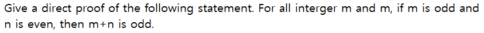
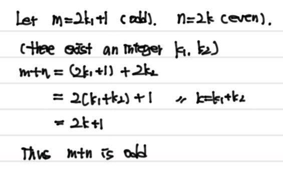

### Mathematical System, Direct Proofs, and Counterexamples

- Mathematical System

  - 구성: 공리, 정의, 정의되지 않는 용어

    - **공리**: 진리라고 가정하는 것
    - **정의**: 기존 개념의 관점에서 새로운 개념을 만드는데 사용되는 것
    - 정의되지 않은 용어(**undefined terms**): 공리에 의해 암묵적으로 정의되는 것

     

- **정리**: 참이라고 증명된 명제

  - 종류
    - **보조정리**: 다른 정리를 증명할 때 유용한 정리
    - **추론**: 다른 정리로부터 쉽게 따라오는 것 

 

- **증명**: 정리의 참을 입증하는 논증
  - 이때 **논리**는 증명의 분석을 위한 도구.
  - 직접 증명: 가정(Hyphothsis)이 참이라고 가정하고, 결론이 참이라고 직접적으로 증명하는 것
    - 공허참(vacuously true)로 인해 **가정이 참일때만 고려**한다.
    - **보조증명**: 보조결과의 증명(더 큰 증명을 위한 부분으로서 만드는 증명)

 

- **반례**: 어떤 명제가 참이 아님을 증명하기 위해, 그 명제가 성립되지 않는 예시.

 

- Some common Errors
  1. 증명을 할 때 별개의 변수에 동일한 notation을 적용하면 안 된다.
  2. 명제 함수가 특정한 값에 대해 참이라고 보이는 것은, 모든 값에 대해 참이라고 하는 것과 다르다.
  3. 증명을 하기 위해, 증명해야할 것을 가정하면 안 된다.

---

- 예제1 
  - 풀이

- 예제2

  

  - 풀이

    

- 예제3

  

  - 풀이

    

- 예제4

  

  - 풀이

    
