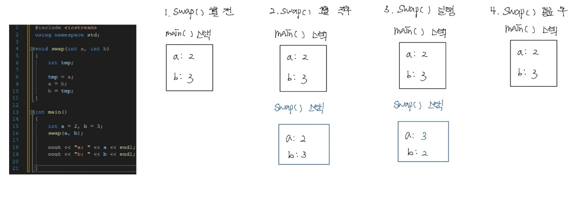
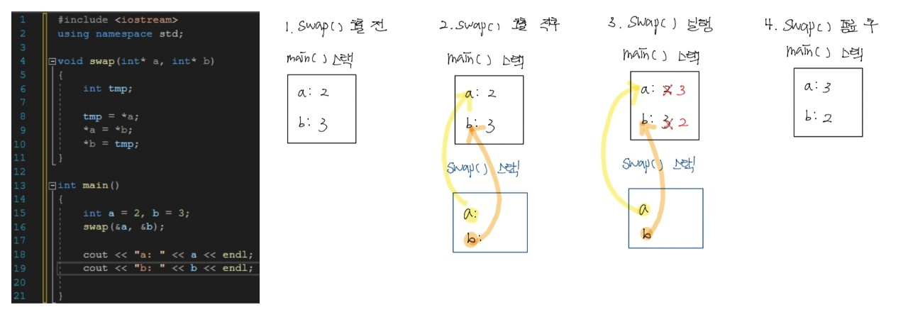

---

title: "Chapter 5 Function and Reference, Copy Constructor"
layout: single
categories:
  - language

tags:
  - Cpp

published: false

---

### 함수와 인자 전달 방식 

<br>

- <span style = "color:red">**Call by value**</span>: 호출하는 코드에서 넘겨주는 <span style="color:blue">실인자 값이 함수의 매개 변수에 복사</span>되어 전달하는 방식

  - 함수 내에서 실인자를 손상시킬 수 없음.

  - 실인자의 크기가 크면 **복사하는 시간이 길어짐(오버헤드)**.

    

<br>

- <span style = "color:red">**Call by address**</span>: <span style = "color:blue">주소</span>를 직접 <span style = "color:blue">포인터 타입</span>의 매개 변수에 전달받는 방식.

  - 의도적으로 함수 내에서 **실인자의 값을 변경**시킬 때 사용.

    

---

### 함수 호출시 객체 전달

<br>

```cpp
// 예제 5-1
#include <iostream>
using namespace std;

class Circle
{
    int radius;

public:
    Circle() { radius = 1; cout << "생성자 실행 radius = " << radius << endl; }
    Circle(int r) { radius = r; cout << "생성자 실행 radius = " << radius << endl; }
    ~Circle() { cout << "소멸자 실행 radius = " << radius << endl; }
    double getArea() { return 3.14 * radius * radius; }
    int getRadius() { return radius; }
    void setRadius(int radius) { this->radius = radius; }
};

void increase(Circle c)
{
    int r = c.getRadius();
    c.setRadius(r + 1);

    cout << "increase 함수에서 radius: " << c.getRadius() << endl;
}

int main()
{
    Circle waffle(30);
    increase(waffle);

    cout << "waffle의 radius: " << waffle.getRadius() << endl;
}
```

<br>

- Call by value: 함수에 객체를 전달할 때 **객체 이름**만 적는다. 이전 인자 전달 방식과 동일하게 값을 복사하여 전달하므로 실인자의 값이 변경되지 않는다.

  - **오버헤드**가 발생한다.

  - <span style = "color:red">생성자는 실행되지 않고, 소멸자만 실행</span>되는 문제점이 있다.

    - 매개 변수에 객체가 전달된 후, 만약 객체의 생성자가 실행된다면 <span style = "color:red">전달받은 원본의 상태를 잃어버림</span>.

    - 이러한 문제점을 해결하기 위해 <span style = "color:red">**복사 생성자**</span> 개념이 등장한다.

<br>

- Call by address: 함수에 객체를 전달할 때 **객체의 주소**를 전달한다.
  - 원본 객체를 복사하는 **시간 소모가 없다**. 
  - 생성자 소멸자의 **비대칭 문제가 없다**.
  - **원본 객체를 훼손**할 수 있다.
  - '*' 기호를 반복적으로 사용함에 따라, 실수의 가능성과 가독성이 떨어진다.

---

### 객체 치환 및 객체 리턴

<br>

```cpp
// 예제 5-2
#include <iostream>
using namespace std;

class Circle
{
    int radius;

public:
    Circle() { radius = 1; }
    Circle(int radius) { this->radius = radius; }
    void setRadius(int radius);
    double getArea();
};

void Circle::setRadius(int radius) { this->radius = radius; }
double Circle::getArea() { return 3.14 * radius * radius; }

Circle getCircle()
{
    Circle tmp(30);
    return tmp; // 객체의 복사본 반환
}

int main()
{
    Circle c;
    cout << c.getArea() << endl;

    c = getCircle(); // tmp 객체가 c에 복사됨.
    cout << c.getArea() << endl;
}
```

- <span style = "color:red">**객체 치환**</span>: 객체의 <span style = "color:blue">모든 데이터가 비트 단위로 복사</span>됨
  - 객체 치환 후 두 객체의 **내용은 완전히 같지만, 별개**이다.

- 함수의 객체 치환
  - 객체를 리턴하면 복사본이 생기고, 이 복사본이 함수를 호출한 곳으로 전달되고, 복사본은 소멸된다.

---

### 참조와 함수

<br>

```cpp
// 예제 5-3
#include <iostream>
using namespace std;

int main()
{
    cout << "i" << '\t' << "n" << '\t' << "refn" << endl;
    int i = 1, n = 2;
    int& refn = n; // 참조변수 refn 선언, refn은 n에 대한 별칭
    n = 4;
    refn++; // refn=5, n = 5
    cout << i << '\t' << n << '\t' << refn << endl;

    cout << "-----------------------------" << endl;
    refn = i; // refn = 1, n = 1
    refn++; // refn = 2, n = 2
    cout << i << '\t' << n << '\t' << refn << "\t // refn = i, refn++;" << endl;

    int* p = &refn; // p는 n의 주소
    *p = 20; // refn = 20, n = 20
    cout << "-----------------------------" << endl;
    cout << i << '\t' << n << '\t' << refn << "\t // *p = &refn, *p = 20" << endl;
}
```

<br>

- <span style = "color:red">**참조 변수**</span>: 이미 선언된 <span style = "color:blue">변수에 대한 별칭</span>으로서, <span style = "color:red">**참조 변수&**</span>를 이용하여 선언하며, 선언 시 반드시 **원본 변수로 초기화**해야 한다.

  - 참조 변수가 선언되면, 참조 변수 **이름만 생성되며 별도의 공간이 할당되지 않는다**.
    - 초기화로 지정된 **원본 변수의 공간을 공유**한다.

  - 참조 변수는 포인터 변수가 아니므로, 참조에 대한 포인터를 만들 수 있다.
  - 원본 변수와 참조 변수를 함께 사용하면 변수 사용이 혼란스러울 수 있다.
  - 주의사항
    - 초기화가 되어있지 않다면 오류가 발생한다.
    - 참조 변수에 대한 참조 선언이 가능하다.
    - 참조 변수의 배열을 만들 수 없다.

<br>

```cpp
// 예제 5-4
#include <iostream>
using namespace std;

class Circle
{
    int radius;

public:
    Circle() { radius = 1; }
    Circle(int radius) { this->radius = radius; }
    void setRadius(int radius);
    double getArea();
};

void Circle::setRadius(int radius) { this->radius = radius; }
double Circle::getArea() { return 3.14 * radius * radius; }

int main()
{
    Circle circle;
    Circle& refc = circle; // Circle 객체에 대한 참조 변수 선언
    refc.setRadius(10);
    
    cout << "refc.getArea() = " << refc.getArea() << endl;
    cout << "circle.getArea() = " << circle.getArea() << endl;
}
```

<br>

```cpp
// 예제 5-5
#include <iostream>
using namespace std;

bool average(int a[], int size, int& avg)
{
	if (size <= 0)
		return false;

	int sum = 0;
	for (int i = 0; i < size; i++)
	{
		sum += a[i];
	}
	avg = sum / size;

	return true;
}

int main()
{
	int x[] = { 0,1,2,3,4,5 };
	int avg;

	if (average(x, 6, avg))
		cout << "평균은 " << avg << endl;
	else
		cout << "매개 변수 오류" << endl;

	if (average(x, -2, avg)) // 크기가 -2이므로 false
		cout << "평균은 " << avg << endl;
	else
		cout << "매개 변수 오류" << endl;
}
```

<br>

- <span style = "color:red">**Call by reference**</span>: 매개 변수를 참조 타입으로 선언해 <span style="color:blue">매개 변수가 함수를 호출 하는 쪽의 실인자를 참조</span>하여 <span style="color:blue">실인자와 공간을 공유</span>하도록 하는 인자 전달 방식.

  - <span style = "color:red">**참조 매개 변수**</span>: <span style="color:blue">참조 타입으로 선언된 함수의 매개 변수</span>

  - call by value와 함수 호출의 모양이 동일하지만, 함수 원형을 보면 그 차이를 알 수 있다.

    그림(call by reference)

  - 가독성이 좋다.

  - 특징

    - 모든 연산은 **원본 객체에 대한 연산**이 된다.
    - **생성자와 소멸자는 실행되지 않는다**.

<br>

```cpp
// 예제 5-6
#include <iostream>
using namespace std;

class Circle
{
    int radius;

public:
    Circle() { radius = 1; cout << "생성자 실행 radius = " << radius << endl; }
    Circle(int radius) { this->radius = radius; cout << "생성자 실행 radius = " << radius << endl; }
    ~Circle() { cout << "소멸자 실행 radius = " << radius << endl; }
    void setRadius(int radius);
    int getRadius();
    double getArea();
};

void Circle::setRadius(int radius) { this->radius = radius; }
int Circle::getRadius() { return radius; }
double Circle::getArea() { return 3.14 * radius * radius; }

void increase(Circle& c)
{
    int r = c.getRadius();
    c.setRadius(r + 1);
}

int main()
{
    Circle waffle(30);
    increase(waffle);

    cout << "waflle.getRadius() = " << waffle.getRadius() << endl;
}
```

```cpp
// 예제 5-7
#include <iostream>
using namespace std;

class Circle
{
    int radius;

public:
    Circle() { radius = 1; }
    Circle(int radius) { this->radius = radius; }
    void setRadius(int radius);
    double getArea();
};

void Circle::setRadius(int radius) { this->radius = radius; }
double Circle::getArea() { return 3.14 * radius * radius; }

void readRadius(Circle& c)
{
    cout << "정수 값으로 반지름을입력하세요>> ";
    int r;
    cin >> r;

    c.setRadius(r);
}

int main()
{
    Circle donut;
    readRadius(donut);

    cout << "donut의 면적 = " << donut.getArea() << endl;
}
```

<br>

```cpp
// 예제 5-8
#include <iostream>
using namespace std;

char& find(char s[], int index)
{
	return s[index];
}

int main()
{
	char name[] = "MIKE";
	cout << "name: " << name << endl;

	find(name, 0) = 'S'; 
	cout << "name: " << name << endl;

	char& ref = find(name, 2);
	ref = 'T';
	cout << "name: " << name << endl;
}
```

- <span style = "color:red">**참조 리턴**</span>: 변수를 리턴하는 것이 아닌, 변수 등과 같이 <span style = "color:blue">현존하는 공간에 대한 참조의 리턴</span>.

  - return 문이 변수에 대한 참조를 return하므로, 변수의 공간에 문자를 삽입한다.

  - 만약 치환문이 온다면, 변수의 값이 치환된다.

    그림(get과 find)

    그림(*, & 차이)
