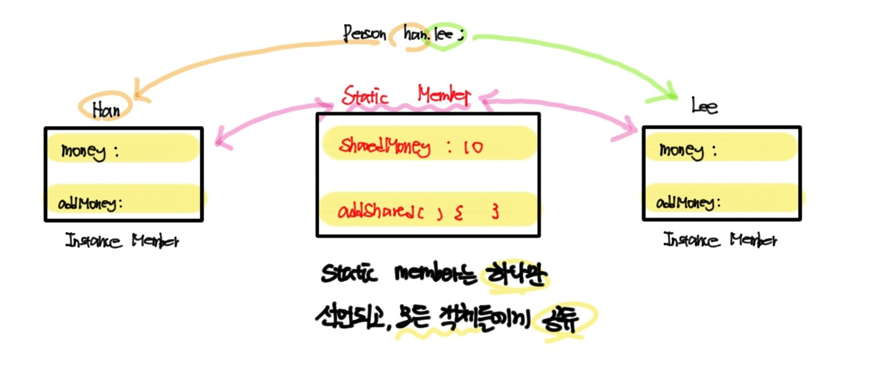

---

title: "Chapter 6 Function Overloading and Static Member"
layout: single
categories:
  - language

tags:
  - Cpp

published: true
---

### 함수 중복

<br>

```cpp
// 예제 6-1
#include <iostream>
using namespace std;

int big(int a, int b) // a와 b 중 큰 수 반환
{
    if (a > b)
        return a;
    else
        return b;
}

int big(int a[], int size) // 배열 내 가장 큰 수 반환
{
    int max = a[0];

    for (int i = 1; i < size; i++)
    {
        if (max < a[i])
        {
            max = a[i];
        }
    }

    return max;
}

int main()
{
    cout << "2와 3중에 큰 수는 " << big(2, 3) << "입니다." << endl;

    int size = 5;
    int* array = new int[size];
    
    for (int i = 0; i < size; i++)
    {
        cout << "array[" << i << "]: ";
        cin >> array[i];
    }

    cout << "array의 원소 중 가장 큰 수는 " << big(array, size) << "입니다. " << endl;
}
```

<br>

- 정의: 다형성의 한 사례로, <span style = "color:blue">같은 이름의 함수를 여러 개 만드는 것</span>.
- 조건
  - 중복된 함수들의 **이름이 동일**해야 한다.
  - 중복된 함수들의 **매개 변수 타입이나 매개 변수의 개수가 서로 달라**야 한다.
  - **리턴 타입은 고려하지 않는다**.
- 특징
  - 함수 중복은 컴파일 시에 이루어지기 때문에, **실행 시간 저하는 없다**.

<br>

```cpp
// 예제 6-2
#include <iostream>
using namespace std;

int sum(int a)
{
	int result = 0;

	for (int i = 1; i <= a; i++)
	{
		result += i;
	}

	return result;
}

int sum(int a, int b)
{
	int result = 0;

	for (int i = a; i <= b; i++)
	{
		result += i;
	}

	return result;
}

int main()
{
	cout << "3에서 5까지의 합: " << sum(3, 5) << endl;
	cout << "0에서 3까지의 합: " << sum(3) << endl;
	cout << "0에서 100까지의 합: " << sum(100) << endl;
}
```

---

### 디폴트 매개 변수

<br>

```cpp
// 예제 6-3
#include <iostream>
#include <string>
using namespace std;

void star(int a = 5);
void msg(int id, string text = "");

void star(int a)
{
	for (int i = 0; i < a; i++)
	{
		cout << '*';
	}
	cout << endl;
}

void msg(int id, string text)
{
	cout << id << ' ' << text << endl;
}

int main()
{
	star(); // Call star(5) by default parameter
	star(10);

	msg(10); // Call(10, "") by default parameter
	msg(10, "Hello");
}

```

<br>

- 정의: 함수가 호출될 때, 매개 변수에 값이 넘어오지 않아 <span style = "color:blue">미리 정해진 디폴트 값을 받도록 선언된 매개 변수</span>

  ```cpp
  <반환형> <함수이름>(<매개변수> = <디폴트 값>) // 매개변수에 디폴트 값을 넣어 전달.
  ```

  - 컴파일러에 의해 처리됨

- 조건

  - 디폴트 매개 변수는 **끝 쪽에 몰려 선언**되어야 한다.
    - <span style = "color:green">컴파일러가 함수를 호출할 때 실인자 값을 앞에서부터 순서대로 전달하고, 나머지는 디폴트 값으로 전달함</span>

- 장점

  - **함수 중복의 간소화**

<br>

```cpp
// 예제 6-4
#include <iostream>
using namespace std;

void f(char c = ' ', int line = 1)
{
	for (int i = 0; i < line; i++)
	{
		for (int j = 0; j < 10; j++)
		{
			cout << c;
		}
		cout << endl;
	}
}

int main()
{
	f(); // Call f(' ', 1)
	f('%'); // Call f('%', 1)
	f('@', 5);
}
```

```cpp
// 예제 6-5
#include <iostream>
using namespace std;

void fillLine(int n = 25, char c = '*')
{
	for (int i = 0; i < n; i++)
	{
		cout << c;
	}

	cout << endl;
}

int main()
{
	fillLine();
	fillLine(10, '%');
}
```

```cpp
// 예제 6-6
#include <iostream>
using namespace std;

class MyVector
{
	int* p;
	int size;

public:
	MyVector(int n = 100)
	{
		p = new int[n];
		size = n;
	}

	~MyVector()
	{
		delete[] p;
	}
};

int main()
{
	MyVector* v1, * v2;
	v1 = new MyVector(); // size = 100
	v2 = new MyVector(1024);

	delete v1;
	delete v2;
}
```

---

### 함수 중복의 모호성

<br>

```cpp
// 예제 6-7
#include <iostream>
using namespace std;

float square(float a)
{
	return a * a;
}

double square(double a)
{
	return a * a;
}

int main()
{
	cout << square(3.0) << endl;
	cout << square(3) << endl; // 에러 발생
    // 오버로드된 함수 "square"의 인스턴스 중 두 개 이상이 인수 목록과 일치합니다.
    // 이를 해결하기 위해선 square((double)3)과 같이 강제 형변환을 해야 한다.
}
```

<br>

- <span style = "color:red">**형 변환으로 인한 모호성**</span>
  - 매개 변수 타입과 호출 문의 실인자 타입이 일치하지 않는 경우, <span style = "color:blue">컴파일러가 묵시적으로 형 변환을 할 때 발생하는 모호성</span>
    - <span style = "color:green">컴파일러는 작은 타입을 큰 타입으로 자동으로 형 변환을 실행</span>

<br>

```cpp
// 예제 6-8
#include <iostream>
using namespace std;

int add(int a, int b)
{
	return a + b;
}

int add(int a, int& b)
{
	b = b + a;
	return b;
}

int main()
{
	int s = 10, t = 20;
	cout << add(s, t) << endl; // 에러 발생
    // 오버로드된 함수 "add"의 인스턴스 중 두 개 이상이 인수 목록과 일치합니다.
}
```

<br>

- <span style = "color:red">**참조 매개 변수로 인한 모호성**</span>
  - 오버로딩된 함수 중에서 <span style = "Color:blue">참조 매개 변수를 가진 함수가 있는 경우</span>, 이들 사이에 모호성이 발생할 수 있다.

<br>

```cpp
// 예제 6-9
#include <iostream>
#include <string>
using namespace std;

void msg(int id)
{
	cout << id << endl;
}

void msg(int id, string s = "")
{
	cout << id << ":" << s << endl;
}

int main()
{
	msg(5, "Good Morning");
	msg(6); // 에러 발생
    // 오버로드된 함수 "add"의 인스턴스 중 두 개 이상이 인수 목록과 일치합니다.	
}
```

<br>

- <span style = "color:red">**디폴트 매개 변수로 인한 모호성**</span>
  - 오버로딩된 함수 중에서, <span style= "color:blue">디폴트 매개 변수를 가진 함수</span>가 어떤 함수를 호출해도 무관할 때와 같은 경우에 모호성이 발생할 수 있다.

---

### static 멤버

<br>

```cpp
// 예제 6-10
#include <iostream>
using namespace std;

class Math
{
public:
	static int abs(int a)
	{
		return a > 0 ? a : -a;
	}

	static int max(int a, int b)
	{
		return (a > b) ? a : b;
	}

	static int min(int a, int b)
	{
		return (a > b) ? b : a;
	}
};

int main()
{
	cout << Math::abs(-5) << endl;
	cout << Math::max(10, 8) << endl;
	cout << Math::min(-3, -8) << endl;
}
```

<br>

- 정의: <span style = "color:blue">메모리에 한 번 할당하면 프로그램 종료 전까지 남아있게 하는 키워드</span>. 변수와 함수의 생명 주기와 사용 범위를 지정하는 방식 중 하나.

  - <span style = "color:green">static, extern, thread_local(C++11), register(지원X)</span>

- 특성

  - 생명 주기: **프로그램이 시작할 때 생성**되고, 프로그램이 종료할 때 소멸

    - <span style = "color:green">메모리 구조와 변수와의 관계에서 기인하는데, 일반적인 지역 변수는 stack에 저장되지만 static 변수는 data에 저장되기 때문</span>
    - non-static 멤버는 객체와 생명 주기를 같이 한다 (<span style = "Color:red">**instance 멤버**</span>)

  - 사용 범위: 변수나 함수가 **선언된 범위 내에서 사용**. 전역과 지역으로 구분

  - 모든 변수와 함수는 static 지정자로 선언 가능하다.

    - static 멤버 변수는 **외부에 전역 변수로 선언**되어야 한다.

      - 다음과 같은 Class가 존재할 때, 객체와 static, instance 멤버사이의 관계

        ```cpp
        class Person
        {
        public:
        	double money;
            void addMoney(int money)
            {
                this->money += money'
            }
            
            static int sharedMoney;
            static void addShared(int n)
            {
                sharedMoney += n;
            }
        };
        
        int Person::sharedMoney = 10;
        ```
        
        
  
- 사용법

  - 객체 이름이나 객체 포인터를 이용해, 보통 멤버와 동일하게 다룬다.
- 클래스의 이름가 범위 지정 연산자(::)를 사용하여 접근 가능하다.
    - static 멤버들은 객체가 생성되기 전부터 사용 가능
  
- 클래스에 static 멤버로 선언하여 캡슐화의 원칙을 지킬 수 있다.
  - 객체 사이에 공유 변수를 사용하고자 할 때 사용한다.

- 특징

  - **static 멤버 함수는 오직 static 멤버들만 접근** 가능하다.
  - 객체가 생성되지 않는 시점에서도 사용 가능하기 때문에, 다른 인스턴스 멤버가 아직 생성되지 않았을 수도 있다.
  
  - static 멤버 함수는 **this를 사용할 수 없다**.


<br>

```cpp
// 예제 6-11
#include <iostream>
using namespace std;

class Circle
{
	static int numofCircles;
	int radius;

public:
	Circle(int r = 1)
	{
		radius = r;
		numofCircles++;
	}

	~Circle()
	{
		numofCircles--;
	}

	static int getnumofCircles()
	{
		return numofCircles;
	}
};

int Circle::numofCircles = 0;

int main()
{
	Circle* p = new Circle[10];
	cout << "현재 원의 개수: " << Circle::getnumofCircles() << endl;

	delete[] p;
	cout << "현재 원의 개수: " << Circle::getnumofCircles() << endl;

	Circle a;
	cout << "현재 원의 개수: " << Circle::getnumofCircles() << endl;

	Circle b;
	cout << "현재 원의 개수: " << Circle::getnumofCircles() << endl;
}
```

---

- 문제풀이: [GitHub - maloveforme/Cpp](https://github.com/maloveforme/Cpp)
