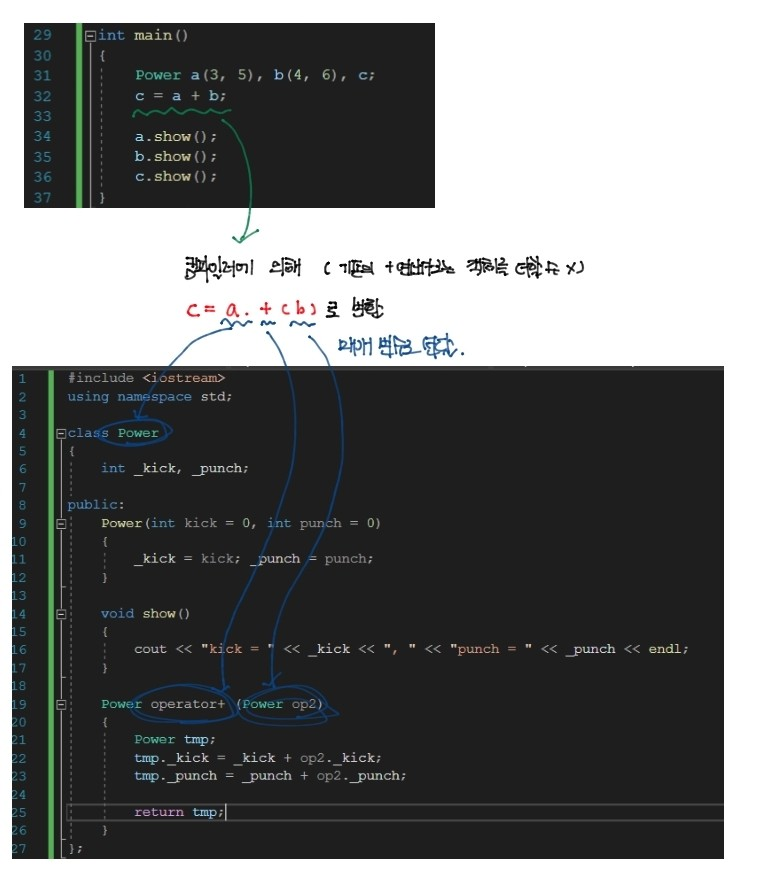

---

title: "Chapter 7 Friends and Operator Overloading 
(1)"
layout: single
categories:
  - language

tags:
  - Cpp

published: true
---

### 프렌드

<br>

```cpp
// 예제 7-1
#include <iostream>
using namespace std;

class Rect; // forward declaration 
bool eqauls(Rect r, Rect s);

class Rect
{
    int _width, _height;

public:
    Rect(int width, int height)
    {
        _width = width; _height = height;
    }

    friend bool equals(Rect r, Rect s);
};

bool equals(Rect r, Rect s)
{
    if (r._width == s._width && r._height == s._height)
        return true;
    else
        return false;
}

int main()
{
    Rect a(3, 4), b(4, 5);

    if (equals(a, b))
        cout << "Equals" << endl;
    else
        cout << "Not equals" << endl;
}
```

- <span style = "color:red">**Forward reference**</span>: <span style = "color:blue">뒤에서 선언되는 이름을 미리 참조하여 사용</span>하는 것. 컴파일러 입장에서는 아직 선언되지 않은 것을 참조하므로 오류로 처리한다.
  - <span style = "color:red">**Forward Declartion**</span>: <span style = "color:blue">변수나 함수, 클래스의 이름을 먼저 선언한 후 이름을 사용</span>하는 것. 전방 참조의 문제를 해결해준다.

<br>

- 정의: <span style = "color:blue">클래스의 멤버 함수와 동일한 접근 자격을 부여</span>할 수 있게 하는 키워드
  - 멤버 함수로는 적합하지 않지만, 클래스의 **은닉된 멤버에게 접근해야 하는 특별한 경우에 사용**함

- 특징
  - 클래스 외부에 선언되어 있으므로 멤버가 아님
  - 프렌드 함수 개수에 제한이 없음
  - 다른 클래스의 멤버 또한 프렌드로 선언할 수 있음

<br>

```cpp
// 예제 7-2
#include <iostream>
using namespace std;

class Rect;

class RectManager
{
public:
    bool equals(Rect r, Rect s);
};

class Rect
{
    int _width, _height;

public:
    Rect(int width, int height)
    {
        _width = width; _height = height;
    }

    friend bool RectManager::equals(Rect r, Rect s);
};

bool RectManager::equals(Rect r, Rect s)
{
    if (r._width == s._width && r._height == s._height)
        return true;
    else
        return false;
}

int main()
{
    Rect a(3, 4), b(4, 5);
    RectManager man;

    if (man.equals(a, b))
        cout << "Equals" << endl;
    else
        cout << "Not equals" << endl;
}
```

```cpp
// 예제 7-3
#include <iostream>
using namespace std;

class Rect;

class RectManager
{
public:
    bool equals(Rect r, Rect s);
    void copy(Rect& dest, Rect& src);
};

class Rect
{
    int _width, _height;

public:
    Rect(int width, int height)
    {
        _width = width; _height = height;
    }

    friend RectManager;
};

bool RectManager::equals(Rect r, Rect s)
{
    if (r._width == s._width && r._height == s._height)
        return true;
    else
        return false;
}

void RectManager::copy(Rect& dest, Rect& src)
{
    dest._width = src._width; dest._height = src._height;
}

int main()
{
    Rect a(3, 4), b(4, 5);
    RectManager man;

    man.copy(b, a);

    if (man.equals(a, b))
        cout << "Equals" << endl;
    else
        cout << "Not equals" << endl;
}
```

---

### 연산자 중복

<br>

- 정의: <span style = "Color:blue">피연산자에 따라 서로 다른 연산</span>을 하도록 <span style = "Color:blue">동일한 연산자를 중복</span>해서 작성하는 것

  - 피연산자의 타입이 다른 연산을 새로 정의하는 것

  ```cpp
  <리턴타입> operator <연산자>(매개변수)
  ```

- 특징
  - 본래부터 있는 연산자에 **새로운 연산 처리를 추가**하는 것
  - 새로운 연산 처리를 수행하는 함수를 통해 구현됨
  - 반드시 클래스와 관계를 가짐
    - **피연산자에 객체를 동반**하기 때문이다.
  - **피연산자의 개수를 바꿀 수 없음**
  - **연산의 우선 순위를 바꿀 수 없음**
  - 중복이 불가능한 연산자가 존재함
    - **.** , **.*** , **::**, **?:**
  
- 작성법
  1. 클래스의 멤버 함수로 구현
  2. 외부 함수로 구현하고 클래스의 프렌드 함수로 구현
  
- 팁

  - 후에 나오지만, 연산자 함수는 멤버 함수로 작성하는 것을 권한다.
  - 연산자 함수는 디폴트 매개 변수를 가질 수 없다.


---

### 이항 연산자 중복

<br>

```cpp
// 예제 7-5
#include <iostream>
using namespace std;

class Power
{
    int _kick, _punch;

public:
    Power(int kick = 0, int punch = 0)
    {
        _kick = kick; _punch = punch;
    }

    void show()
    {
        cout << "kick = " << _kick << ", " << "punch = " << _punch << endl;
    }

    Power operator+ (Power op2)
    {
        Power tmp;
        tmp._kick = _kick + op2._kick;
        tmp._punch = _punch + op2._punch;
        
        return tmp;
    }
};

int main()
{
    Power a(3, 5), b(4, 6), c;
    c = a + b;

    a.show();
    b.show();
    c.show();
}
```

- 과정
  - 연산자 착안: 연산자의 의미를 결정한다.
  - 연산자 함수 선언
  - 연산자 함수 구현



- 이때 연산자 함수에 **참조 매개 변수**를 사용해도 무관하다
  - <span style = "color:green"> 매개 변수로 객체가 복사되지 않지만, 원본 객체를 수정할 수 있기 때문에 </span>주의해야 한다.

<br>

```cpp
// 예제 7-5
#include <iostream>
using namespace std;

class Power
{
    int _kick, _punch;

public:
    Power(int kick = 0, int punch = 0)
    {
        _kick = kick; _punch = punch;
    }

    void show()
    {
        cout << "kick = " << _kick << ", " << "punch = " << _punch << endl;
    }

    bool operator == (Power op2)
    {
        if (_kick == op2._kick && _punch == op2._punch)
            return true;
        else
            return false;
    }
};

int main()
{
    Power a(3, 5), b(4, 6);
    Power c(3, 3), d(3, 3);
    
    a.show();
    b.show();
    c.show();
    d.show();

    if (a == b)
        cout << "a와 b는 같다" << endl;
    else
        cout << "a와 b는 다르다" << endl;

    if (c == d)
        cout << "a와 b는 같다" << endl;
    else
        cout << "a와 b는 다르다" << endl;
}
```

```cpp
// 예제 7-6
#include <iostream>
using namespace std;

class Power
{
    int _kick, _punch;

public:
    Power(int kick = 0, int punch = 0)
    {
        _kick = kick; _punch = punch;
    }

    void show()
    {
        cout << "kick = " << _kick << ", " << "punch = " << _punch << endl;
    }

    Power& operator += (Power op2)
    {
        _kick = _kick + op2._kick;  
        _punch = _punch + op2._punch;

        return *this;
    } 
};

int main()
{
    Power a(3, 5), b(4, 6);
    
    a.show(); b.show();

    a += b;
    a.show();
    b.show();
}
```

- 리턴 타입이 &인 이유
  - 객체의 참조를 리턴하지 않는다면, 리턴된 객체가 복사본에 더하게 되므로 영향이 가지 않는다. (값에 의한 호출)
  - 따라서 객체의 참조를 리턴함으로써 원본에 접근해야 한다.

<br>

```cpp
// 예제 7-7
#include <iostream>
using namespace std;

class Power
{
    int _kick, _punch;

public:
    Power(int kick = 0, int punch = 0)
    {
        _kick = kick; _punch = punch;
    }

    void show()
    {
        cout << "kick = " << _kick << ", " << "punch = " << _punch << endl;
    }

    Power operator + (int op2)
    {
        Power tmp;

        tmp._kick = _kick + op2;
        tmp._punch = _punch + op2;

        return tmp;
    }
};

int main()
{
    Power a(3, 5), b;

    a.show(); b.show();

    b = a + 2;
    a.show();
    b.show();

```

---

- 문제풀이: [GitHub - maloveforme/Cpp](https://github.com/maloveforme/Cpp)
