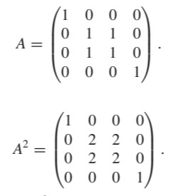

### Matrices of Relation

 

- **Matrix of Relation**

  - 정의: xRy의 관계에서 행(row)을 x, 열(column)을 y에 기입해 만든 행렬 

    ex) R = { (1,b). (1,d), (2,c), (3,c), (3,b), (4,a)}일 때

    
  
  - 특징

    - 항상 사각 행렬(square matrix)이다.
    - 관계를 간편하게 나타내는 방법이다.
  
  - 속성 결정: R에 대한 행렬 A에 대해 다음을 만족하면 해당 속성이 결정된다.
  
    - Reflexive: A의 main diagonal에 1만 있는 경우
  
      ex)
  
    - Symmetric: A의 (i, j)와 (j, i)가 같은 경우
  
      - 즉, main diagonal에 대해 대칭인 경우
  
      ex)
  
    - Transitive: A^2의 (i, j)가 0이 아니고, A의 (i, j)도 0이 아닌 경우 
  
      ex) 

---

- you can read a pdf file of this content in 

[DiscreteMath_3-5](https://github.com/maloveforme/maloveforme.github.io/tree/master/summary/DM)
